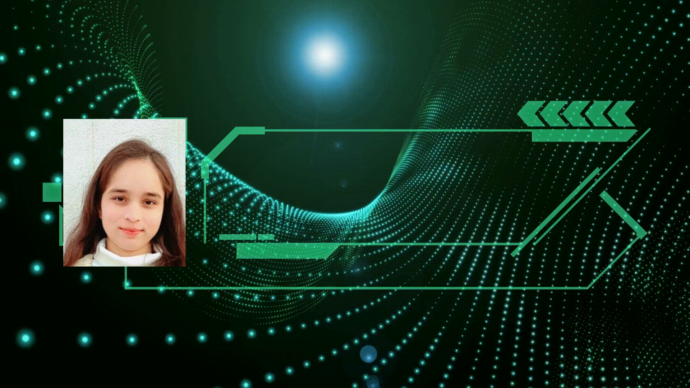

<h1 align="center">Hi 👋, I'm Sonia Yadav</h1>

  <table>
  <tr>
    <td width="60%">
      <ul>
        
I'm a technology lover interested in software development and always keen to discover new technologies. Having experience in frontend and backend development, I'm interested in developing significant applications and discovering areas like Web Development, AI, and Machine Learning.

        <li>💡 Always open to learn and collaborate</li>
        <li>🤝 Let’s build something amazing together!</li>
        <li>📫 Drop a mail at: <a  href="mailto:sonia_2022bite030@nitsri.ac.in">sonia_2022bite030@nitsri.ac.in</a></li>
        <li>🌐 Wanna know more about me? <a href="https://sonia-yadav.netlify.app/">Visit my portfolio</a></li>
      </ul>
    </td>
    <td width="40%" align="center">
     
    </td>
  </tr>
</table>

  <ul align="center">
    
<h2 align="center" style="display: inline-block">👩🏻‍💻 Technologies That I Know </h2>

  </ul>

<!--tech stack icons-->

  

  <h2>📊 GitHub Stats </h2>
  

<!-- Connect with me -->

  <ul align="center">
    
<h2 align="center" style="display: inline-block">🌍 Connect With Me </h2>

  </ul>

<!--icons and links-->

  
  

  

